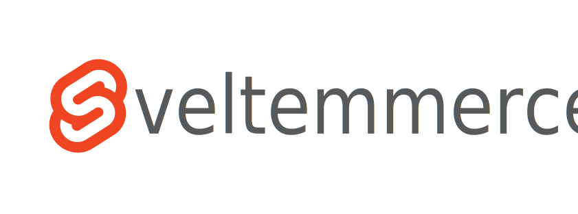

[](https://travis-ci.org/ivanlori/Sveltemmerce)
[](https://david-dm.org/ivanlori/Sveltemmerce#info=devDependencies)
[](https://github.com/ivanlori/Sveltemmerce/blob/master/LICENSE)
[](https://twitter.com/intent/tweet?text=Wow:&url=https%3A%2F%2Fgithub.com%2Fivanlori%2FSveltemmerce)

# Sveltemmerce: E-commerce Template 🛒

Responsive e-commerce template built with Svelte.js and Tailwindcss.

---

## Features

- Search product;
- Product detail;
- Quantity select;

## Requisites

What Svelte.js is? Check the [documentation](https://svelte.dev/) out

What Tailwind CSS is? Check the [documentation](https://tailwindcss.com/) out

## Installing

```

# clone the repository
git clone https://github.com/ivanlori/Sveltemmerce.git

# install dependencies
yarn install

# serve with hot reload at localhost:3000
yarn dev

# build for production
yarn build

```

---

## Authors

- **Ivan Lori** - _Initial work_ - [ivanlori](https://github.com/ivanlori)

---

If you have any questions, feel free to email me at [ivan.lori@protonmail.com](mailto:ivan.lori@protonmail.com).

---

## License

This project is licensed under the MIT License - see the [LICENSE.md](LICENSE.md) file for details

Searching an ecommerce template made with Vue.js?
Check [Vuemmerce](https://github.com/ivanlori/Vuemmerce) out!
